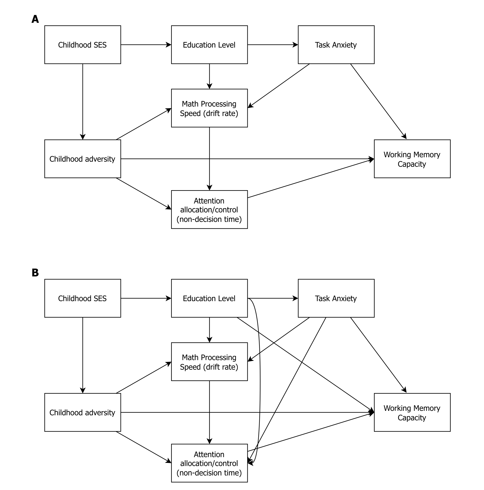
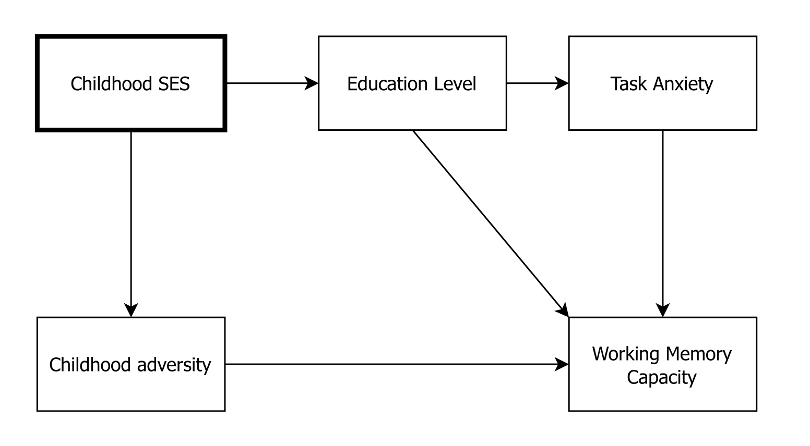
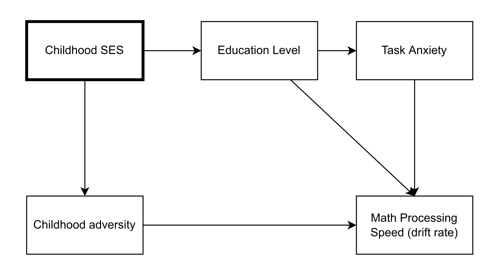
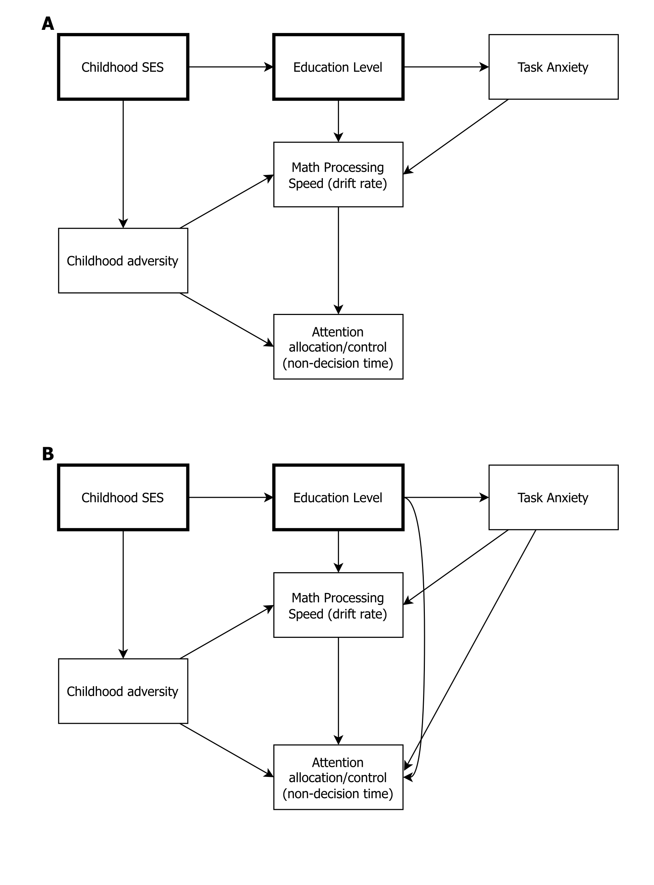

Preregistration Pilot 1
================

*Last updated 2022-04-22 15:22:51*

## Part 1 - Study Information

### Q1. Working title

The role of present-oriented attention control in working memory
capacity performance for people from harsh environments.

### Q2. Authors

-   [Stefan
    Vermeent](https://www.stefan-vermeent.nl)1,2
-   [Ethan S. Young](https://www.ethan-young.com/)1
    
-   Jean-Louis van
    Gelder2,3
-   [Willem E.
    Frankenhuis](http://www.willem.maartenfrankenhuis.nl/)1,2

1Utrecht University

2Max Planck Institute for the Study of Crime, Security and
Law

3Leiden University

### Q3. Description

This preregistration covers the first pilot study of this project. The
purpose of the project is to understand performance differences on
working memory capacity (WMC) as a function of early-life adversity. We
include two versions of the Operation Span (Ospan) task: a standard
version and and a more present-oriented version.

### Q4. Research questions

1.  Is early life adversity exposure associated with lower WMC
    performance, and can performance be improved on a more
    present-oriented version of the task?
2.  What are the cognitive mechanisms underlying performance differences
    on the WMC task?

### Q5. Hypotheses and Causal Models

The two candidate Directed Acyclic Graphs (DAG) representing the causal
model connecting all variables of interest is depicted in the figure
below.

Each hypothesis tests a part of this overall DAG. We present the DAG
corresponding to each hypotheses below.

1.  Individuals with more early-life adversity have a lower WMC (i.e.,
    letter recall) than individuals with less early-life adversity on
    the standard version of the Ospan, but benefit comparatively more
    from the present-oriented version of the Ospan.

2.  Individuals with more early-life adversity process the math
    equations more slowly (operationalized through the [Drift
    Rate](#DDM)) than individuals with less early-life adversity on the
    standard version of the Ospan. We have no a-priori expectations
    about a moderation by task version.

3.  Individuals with more early-life adversity allocate less time to the
    maintenance of letters in working memory (operationalized through
    the [non-decision time](#DDM)) than individuals with less early-life
    adversity on the standard version of the Ospan, but show a
    comparatively bigger increase in non-decision time on the
    present-oriented version of the Ospan.

## Part 2 - Design Plan

### Q1. Study type

cross-sectional with experimental manipulation.

### Q2. Study design

The study has one within-subject factor (Ospan task version; standard
vs. present-oriented) and a continuous between-subject factor
(early-life adversity; operationalized as violence exposure and
unpredictability). The order of the task versions is counterbalanced.

## Part 3 - Sampling Plan

### Q1. Data collection procedures

Data will be collected using the online research platform Prolific
Academic. People are eligible for participation if they 1) grew up and
currently live in the United States; 2) Speak fluent English; 3) Are
between the ages of 18 and 30. We balance our sample to include 50%
males. Using the MacArthur Scale of Subjective Social Status that is a
part of Prolific’s pre-screening questions, we make sure that 50% of the
sample consists of participants who indicated their current perceived
socio-economic status (SES) to be relatively low (between 1 and 4 on a
10-point scale), and 50% consists of participants who have a high
perceived SES (between 5 and 10).

### Q2. Sample size

Our target sample size is 500 people. Based on previous experiences with
similar online studies, we expect to exclude around 50 participants who
fail inclusion criteria or encounter technical issues. Therefore, we
sample a total of 550 participants.

### Q3. Sample size rationale

We conducted a power simulation using the *faux* package in R
([DeBruine, 2021](#ref-debruine_2021)) to determine the optimal number
of participants to include (more information including all simulation
code on
[Github](https://github.com/StefanVermeent/attention_project/tree/preregistration1/preregistrations/1_pilot/scripts)).
Assuming a small effect size of *β* = 0.1 and a [DDM](#DDM) parameter
recovery accuracy of *r* = .85, we estimated that we would need 500
participants to achieve at least 80% power. We sampled a total of 550
participants to account for necessary exclusions (based on our
experiences in the pilot study).

## Part 4 - Variables

### Q1. Manipulated variables

Ospan task condition: all participants complete a standard version and a
newly developed ‘present-oriented’ version of the Ospan task. In the
Ospan task, participants have to perform two tasks simultaneously: 1)
remember an increasingly long sequence of letters (between 3 and 5); 2)
determine whether the outcome of a mathematical equation is correct or
incorrect. The two tasks alternate, meaning people have to maintain and
rehearse the letters in working memory while solving the equations. Both
versions have the same basic visual structure: the letters spatially
laid out from left to right in the upper portion of the screen and
covered by black squares. The math equations are presented below the
letters. In the standard version, the letters and covering boxes
disappear whenever the math equation is shown. In the present-oriented
version, the boxes remain on the screen when the math equation is shown.
See [The Github
Repository](https://github.com/StefanVermeent/WMC/tree/main/0_pilot_study/materials)
for task materials and [here](https://wmc-tasks.netlify.app) for a
working version of the task.

### Q2. Measured variables

**Dependent variables (raw)**

Each version of the Ospan provides the following DVs:

1.  ospan_cap: performance on letter recall. Scored using partial-credit
    unit scoring, which calculates the average proportion correct across
    all blocks and all span lengths ([Conway et al.,
    2005](#ref-conway_2005))

**Dependent variables ([Drift Diffusion parameters](#DDM))**

2.  Ospan_math_v: Drift rate across all math trials.
3.  Ospan_math_t0: Non-decision time across all math trials.

### Q3. Independent variables

1.  `vio_comp`: Violence exposure composite score. Consists of the
    unweighted average of two measures:
    -   `nvs_mean`: mean score on items of the Neighborhood Violence
        Scale ([Frankenhuis et al.,
        2020](#ref-frankenhuis_deVries_2020); [Frankenhuis & Bijlstra,
        2018](#ref-frankenhuis_2018)).
    -   Fighting_mean: The unweighted average of two items related to
        witnessing and participating in fights before age 13. `nvs_mean`
        and `fighting_mean` are z-transformed prior to averaging.
2.  `unp_comp`: Unpredictability composite score. Consists of the
    unweighted average of subjective unpredictability (`unp_subj`) and
    objective unpredictability (`unp_obj`), both of which are scaled
    before averaging. These measures consist of:
    -   Subjective unpredictability. Each of the following measures was
        z-transformed and then combined into a single scale through
        unweighted averaging:
        -   Questionnaire of Unpredictability in Childhood \[QUIC
            (adapted); Glynn et al. ([2019](#ref-glynn_2019))\]: We made
            three general changes to the original scale as described in
            Glynn et al. (2019). First, we adapted all items to refer to
            experiences before age 13. This was done to reduce cognitive
            load from having to go back-and-forth between different time
            scales. Second, most items were rated on a scale of 1 (never
            true) to 5 (very often true) instead of the original yes/no
            answer format. An exception was made for four items of the
            parental environment scale which asked for more specific
            experiences (e.g., “I experienced changes in my custody
            arrangement”). For these items, we adopted a response scale
            with the options “never”, “only once”, “a couple times”,
            “several times”, “many times”. Third, quantifiers such as
            “frequently”, “often”, and “There was a period of time when
            \[…\]” were dropped to better match the response scale. We
            excluded the item “My parents got divorced” because it did
            not fit the response format and was captured by one of the
            items of the perceived unpredictability scale. An overall
            QUIC variable is computed by averaging all unweighted items.
        -   Perceived Unpredictability Scale (NVS): Consists of eight
            items measuring perceived unpredictability before age 13
            (e.g, “My family life was generally inconsistent and
            unpredictable from day-to-day”). Participants rated each on
            a scale from 1 (never true) to 5 (very often true).
        -   Confusion, Hubbub, and Order Scale \[CHAOS (adapted);
            Matheny et al. ([1995](#ref-matheny_1995))\]: Consists of 15
            items measuring the level of chaos in the household (e.g.,
            “No matter how hard we tried, we always seemed to be running
            late”). We make two changes to the original scale as
            described in Matheny et al. ([1995](#ref-matheny_1995)).
            First, all items are converted from the present tense to the
            past tense, and are endorsed as applying to participants’
            lives before age 13. Second, all items are rated on a scale
            of 1 (never true) to 5 (very often true) instead of the
            original yes/no answer format. An overall household chaos
            variable is computed by averaging the 15 unweighted items.
    -   Objective unpredictability. Each of the following measures was
        z-transformed and then combined into a single scale through
        unweighted averaging:
        -   Four items measuring the stability of the family and social
            environment. On a scale of 1 (the same all the time) to 5
            (constant and rapid changes), participants indicated how
            often the following aspects of their family and social
            environment changed before age 13: 1) economic status, 2)
            family environment, 3) childhood neighborhood environment,
            and 4) childhood school environment. The four items were
            averaged together.
        -   Residential changes. Participants answered the question
            “Before age 13, how many times did you move homes?” in an
            open response format.
        -   Household situation. Participants answered the question
            “Before age 13, did any other adults besides your caregivers
            live in your primary residence?” with either yes or no. If
            participants answered yes, two additional questions asked
            “How many different adult women (men) (**not** including
            your parent/caregiver) lived in your primary residence for a
            period of time?”. If the participant’s answer to one of
            these questions was \> 0, this prompted the additional
            question “Of those women (men), how many were romantically
            involved with (the wife or girlfriend of) your
            parent/caregiver.”. If participants did not reach any of the
            follow-up items because of their initial answer, their
            values were set to 0. We averaged the number of romantic
            partners for both parents/caregivers into a single variable.
            In addition, we calculated household size by summing the
            number of different adult men and women that lived in the
            primary residence for some period of time.

### Q4. Covariates

In our [DAGs](#hypotheses), we expect that task anxiety and education
level are causal factors on WMC performance, but that both are in turn
caused by SES. Under this DAG, therefore, controlling for SES would also
account for the effects of task anxiety and education level. We will
test these assumptions prior to fitting the main models using Pearson
correlations and linear regressions. If we find that task anxiety and/or
education level are not associated with SES or retain a significant
association with task performance after controlling for SES, we will
also include them as covariates.

1.  `ses_comp`: Childhood socio-economic status (SES) composite score.
    Consists of the unweighted average of subjective SES (`ses_subj`)
    and objective SES (`ses_obj`), both of which are scaled before
    averaging. These measures consist of:

    -   Subjective SES. Each of the following measures was z-tranformed
        and then combined into a single scale through unweighted
        averaging:
        -   Perceived level of resource scarcity. Consists of seven
            items (e.g., “Your family had enough money to afford the
            kind of home you all needed”). The items are averaged
            together to create an unweighted composite score.
        -   Childhood social class. Participants answered the question
            “Which of these classes would you say your family belonged
            to **when you were growing up**?” on a 5-point scale:
            ‘Poor’, ‘Working class’, ‘Middle class’, ‘Upper-middle
            class’, ‘Upper class’.
    -   Objective SES. Each of the following measures was z-tranformed
        and then combined into a single scale through unweighted
        averaging:
        -   Highest education of caregivers/parents. Separate items for
            each caregiver, on an 8-point scale: ‘some high school’,
            ‘GED’, ‘high school diploma’, ‘some college but no college
            degree’, associate’s degree’, ‘bachelor’s degree’, ‘master’s
            degree’, or ‘doctoral or lab degree’. The caregivers’
            education levels are averaged to create an overall
            unweighted parental education composite.
        -   Childhood household income. six-point scale: ‘less than $
            25k/year’, ‘$25k - $49k/year,’$50 - $74k/year’, ‘$75 -
            $99k/year’, ‘$100 - $149k/year’, ‘more than $150k/year’.

2.  `education`: Highest education of the participant. on an 8-point
    scale: ‘some high school’, ‘GED’, ‘high school diploma’, ‘some
    college but no college degree’, associate’s degree’, ‘bachelor’s
    degree’, ‘master’s degree’, or ‘doctoral or lab degree’. The
    variable will be treated as a continuous variable.

3.  `task_anxiety`: A single item after completing both versions of the
    WMC task: “How anxious did you feel about playing the Letters and
    Numbers game?”, rated on a scale of 1 (“not at all anxious”) to 5
    (“Very anxious”).

## Part 5 - Analysis Plan

### Q1. Drift Diffusion Modeling (DDM)

DDM is a computational modeling technique for forced-choice binary
decision-making processes that takes trial-level reaction times and
accuracy and translates them into several distinct, latent cognitive
processes. These processes are 1) Drift rate (*v*), which is a measure
of processing speed, 2) Boundary separation (*a*), which is a measure of
response caution, 3) Non-decision time (\*\*T0\*), which contains any
process that is not related to the decision-making component, such as
stimulus encoding and response preparation, and 4) Starting point, which
indicates a potential response bias towards one of the two options.

DDM models are fit to the RT/accuracy data of the math subtask,
separately for each task version (standard and present-oriented) and
separately for each participant. The models are fit with the Fast-dm
software ([Voss & Voss, 2007](#ref-voss_2007)). We use Maximum
Likelihood estimation as it has been shown to provide reliable estimates
with relatively few trials ([Lerche et al., 2017](#ref-lerche_2017)).
Parameters *a*, *v* and *T0* are freely estimated and *z* is fixed to
0.5 (the midpoint, indicating no response bias). In addition, all
inter-trial variability parameters are fixed to 0 to increase model
parsimony.

The model fit for all participants will be assessed visually through
QQ-plots comparing the empirical data with the model predictions
following Grange & Rydon-Grange ([2020](#ref-grange_2020)). Using each
participant’s best-fitting parameters, we simulate RTs and accuracy for
50,000 trials of each Ospan version. We calculate the total proportion
accuracy and the 25th, 50th, and 75th quantile of the response time
distribution (correct trials only) for both the simulated data and the
empirical data. The outcomes for all participants were plotted against
each other. The closer the points are to the diagonal line, the better
the models fit the participants’ data.

While our main [statistical models](#analyses) are focused on DDM
parameters recovered using maximum likelihood estimation, we will also
explore the hierarchical Bayesian implementation of the DDM \[HDDM;
Wiecki et al. ([2013](#ref-wiecki_2013))\] as an alternative. Both
approaches have been shown to perform well when the number of trials is
low (\< 50) and in situations where there are “slow contaminants”, i.e.,
trials with relatively long reaction times that are not produced by a
diffusion process (e.g., a participant who is guessing or gets
distracted). However, the HDDM might produce slightly more robust
estimates as it allows for the use of group-level information when
estimating DDM parameters. This is particularly useful in situations
with a small number of trials but a relatively large number of
participants. We will compare the recovered DDM parameters using maximum
likelihood estimation and HDDM estimation to see to what extent they
converge.

Finally, we plan to explore the use of the Time-Based Resource Sharing
(TBRS) model of working memory to assess the way in which participants
focus their attention on the task. Specifically, we plan to use the
measurement model based on TBRS as developed by Gauvrit & Mathy
([2018](#ref-gauvrit_2018)) (TBRS2). This model extracts four parameters
summarizing participants’ performance: 1) decay rate *d*, which
specifies the rate at which memory items decay over time; 2) refreshment
rate *r*, which is the speed with which memory items are refreshed in
working memory by re-attending to them; 3) baseline *β*, which is the
activation of an item when it is presented; 4) duration of item
refreshing. We plan to use this pilot study to develop an optimal model
fitting routine.

### Q2. Statistical models

As discussed under [Covariates](#covariates), all models will include
SES as a covariate, as well as education level and task anxiety if
necessary.

1.  Individuals with more early-life adversity have a lower WMC (i.e.,
    letter recall) than individuals with less early-life adversity on
    the standard version of the Ospan, but benefit comparatively more
    from the present-oriented version of the Ospan.
    -   Linear mixed model:
        `lmer(ospan_cap ~ vio_comp * task_version + ses_comp + (1|id))`
    -   Linear mixed model:
        `lmer(ospan_cap ~ unp_comp * task_version + ses_comp + (1|id))`
2.  Individuals with more early-life adversity process the math
    equations more slowly (operationalized through the [Drift
    Rate](#DDM)) than individuals with less early-life adversity on the
    standard version of the Ospan. We have no a-priori expectations
    about a moderation by task version.
    -   Linear mixed model:
        `lmer(ospan_math_v ~ vio_comp * task_version + ses_comp + (1|id))`
    -   Linear mixed model:
        `lmer(ospan_math_v ~ unp_comp * task_version + ses_comp + (1|id))`
3.  Individuals with more early-life adversity allocate less time to the
    maintenance of letters in working memory (operationalized through
    the [non-decision time](#DDM)) than individuals with less early-life
    adversity on the standard version of the Ospan, but show a
    comparatively bigger increase in non-decision time on the
    present-oriented version of the Ospan.
    -   Linear mixed model:
        `lmer(ospan_math_t0 ~ vio_comp * task_version + ses_comp + (1|id))`
    -   Linear mixed model:
        `lmer(ospan_math_t0 ~ unp_comp * task_version + ses_comp + (1|id))`

### Q3. Multiverse analyses

Online experiments come at the trade-off of having less experimental
control over the way in which participants complete the experiment and
over the environment in which they do so. It is largely unclear which
factors affect performance and how strong these effects are. We used
multiverse analysis for all main analysis to assess the robustness of
the results against various environmental factors and situations during
the experiment. We identified six arbitrary analytic decisions,
including or excluding 1) participants who had a recaptcha score below
0.5 (possibly indicating bots); 2) participants who did not enter
fullscreen mode prior to starting the task; 3) participants who exited
fullscreen mode at any point during the task; 4) participants who did
not resize the screen at the start of the experiment; 5) participants
who indicated high levels of noise in their environment; 6) participants
who indicated extreme interruptions during the experiment.

For each analysis, we report the median *β*, 95% confidence intervals,
proportion of *p*-values \< .05 across all analytic decisions. For the
primary analyses, we used a bootstrapping technique to compute overall
*p*-values to assess whether the obtained median *β* is significantly
larger than zero ([Simonsohn et al., 2020](#ref-simonsohn_2020)).

### Q4. Participant-level exclusions

First, we exclude participants who do not complete the full study and
those who do not complete both versions of the Ospan. Second, we analyze
responses to the attention checks and reversed coded items in the
questionnaire part of the experiment. We exclude participants if they
miss both attention check items or if they have suspicious response
patterns (e.g., consistently endorsing high response options even when
some items were reverse coded). Third, we exclude participants whose
screen height is \< 700 pixels, or whose screen height is bigger than
their screen width (suggesting that they do not complete the experiment
on a laptop or desktop pc). Finally, we use the open-ended participant
feedback and manual data checks to determine potential additional
participants to exclude.

Typically, participants are excluded when their accuracy on the
secondary task is below \~80% to ensure adequate effort. However,
because our sample is diverse and because we use novel versions of the
O-span, we do not set a hard cut-off for performance *a-priori*.
Instead, we plan to determine an adequate performance threshold based on
the full distribution that we will find in our data.

### Q5. Trial-level exclusions

trials with reaction times \< 300 ms ([Ratcliff & Childers,
2015](#ref-ratcliff_2015)) were excluded from the analyses. The math
trials have a maximum duration of 6000 ms if no response is provided. We
do not have an *a-priori* cut-off point for trials (such as the
typically used 3500 ms). In addition, trials with a log-transformed
reaction time \> 3.2 SDs above the subject-level mean are excluded.

Participants with more than 10 removed trials were excluded from the
analyses. Finally, we logged whether participants exited full-screen
mode and/or engaged with other browser tabs (i.e., blur events) at any
point during the Task. We excluded participants for whom blur events
occurred while the task was ongoing (but not while reading instructions
or taking breaks in between versions). Full-screen exits were included
in the [multiverse analysis](#multiverse).

## References

Conway, A. R. A., Kane, M. J., Bunting, M. F., Hambrick, D. Z., Wilhelm,
O., & Engle, R. W. (2005). Working memory span tasks: A methodological
review and user’s guide. *Psychonomic Bulletin & Review*, *12*(5),
769–786. https://doi.org/<https://doi.org/10.3758/BF03196772>

DeBruine, L. (2021). *Faux: Simulation for factorial designs*. Zenodo.
<https://doi.org/10.5281/zenodo.5513951>

Frankenhuis, W. E., & Bijlstra, G. (2018). Does exposure to hostile
environments predict enhanced emotion detection? *Collabra: Psychology*,
*4*(1), 18. https://doi.org/<https://doi.org/10.1525/collabra.127>

Frankenhuis, W. E., Vries, S. A. de, Bianchi, J., & Ellis, B. J. (2020).
Hidden talents in harsh conditions? A preregistered study of memory and
reasoning about social dominance. *Developmental Science*, *23*(4),
e12835. https://doi.org/<https://doi.org/10.1111/desc.12835>

Gauvrit, N., & Mathy, F. (2018). Mathematical transcription of the
“time-based resource sharing” theory of working memory. *British Journal
of Mathematical and Statistical Psychology*, *71*(1), 146–166.
<https://doi.org/10.1111/bmsp.12112>

Glynn, L. M., Stern, H. S., Howland, M. A., Risbrough, V. B., Baker, D.
G., Nievergelt, C. M., Baram, T. Z., & Davis, E. P. (2019). Measuring
novel antecedents of mental illness: The Questionnaire of
Unpredictability in Childhood. *Neuropsychopharmacology*, *44*(5),
876–882. <https://doi.org/10.1038/s41386-018-0280-9>

Grange, J. A., & Rydon-Grange, M. (2020). Computational modelling of
attentional selectivity in depression reveals perceptual deficits.
*Psychological Medicine*, 1–10.
<https://doi.org/10.1017/S0033291720002652>

Lerche, V., Voss, A., & Nagler, M. (2017). How many trials are required
for parameter estimation in diffusion modeling? A comparison of
different optimization criteria. *Behavior Research Methods*, *49*(2),
513–537. <https://doi.org/10.3758/s13428-016-0740-2>

Matheny, A. P., Wachs, T. D., Ludwig, J. L., & Phillips, K. (1995).
Bringing order out of chaos: Psychometric characteristics of the
Confusion, Hubbub, and Order Scale. *Journal of Applied Developmental
Psychology*, *16*(3), 429–444.
<https://doi.org/10.1016/0193-3973(95)90028-4>

Ratcliff, R., & Childers, R. (2015). Individual differences and fitting
methods for the two-choice diffusion model of decision making.
*Decision*, *2*(4), 237–279.
https://doi.org/<https://doi.org/10.1037/dec0000030>

Simonsohn, U., Simmons, J. P., & Nelson, L. D. (2020). Specification
curve analysis. *Nature Human Behaviour*, *4*(11), 1208–1214.
<https://doi.org/10.1038/s41562-020-0912-z>

Voss, A., & Voss, J. (2007). Fast-dm: A free program for efficient
diffusion model analysis. *Behavior Research Methods*, *39*(4), 767–775.
https://doi.org/<https://doi.org/10.3758/BF03192967>

Wiecki, T. V., Sofer, I., & Frank, M. J. (2013). HDDM: Hierarchical
Bayesian estimation of the Drift-Diffusion Model in Python. *Frontiers
in Neuroinformatics*, *7*. <https://doi.org/10.3389/fninf.2013.00014>

